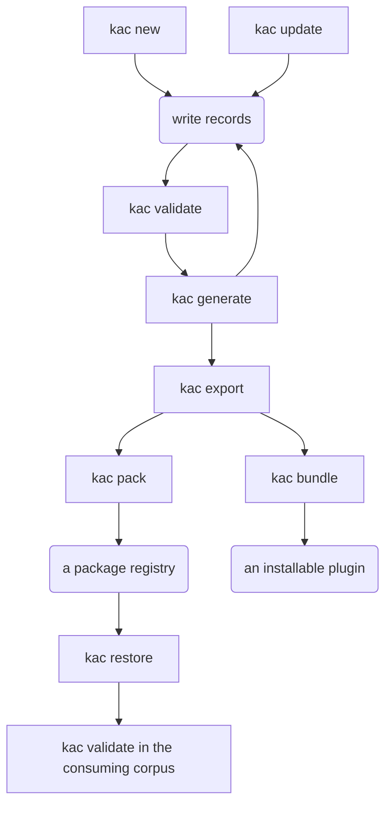

# CLI reference

One page per command. Each opens with the usage the parser accepts, generated from `kac` itself, then says what the
command does, works through examples with the output they print, and names its known limits.

Why a command works the way it does is not on these pages. [Design](../design/index.md) carries that, and each page
links the part of it that explains the command.

## The commands

<!-- BEGIN GENERATED: command-table -->

| Command                   | What it does                                            |
|---------------------------|---------------------------------------------------------|
| [`new`](new.md)           | Stand a corpus up in the folder you are in.             |
| [`validate`](validate.md) | Check the corpus against its schema.                    |
| [`generate`](generate.md) | Rewrite the parts of a corpus derived from its records. |
| [`restore`](restore.md)   | Fetch the corpora this one consumes.                    |
| [`export`](export.md)     | Write the corpus out as data a consumer can read.       |
| [`bundle`](bundle.md)     | Assemble the export into an installable agent plugin.   |
| [`pack`](pack.md)         | Seal the export into a versioned package.               |
| [`checks`](checks.md)     | List every check the validator can report.              |
| [`update`](update.md)     | Take a newer framework into a corpus.                   |

<!-- END GENERATED: command-table -->

## The order the commands run in

Most commands sit in one sequence. You stand a corpus up, write records, hold them to the schema, and rebuild what the
corpus derives from them. Everything after that is optional, and which branch you take depends on whether one corpus
serves you or several.

A square box is a command you type. A rounded one is what you do or what you get.

**The loop is the part you live in.** Write a record, run [`validate`](validate.md), run [`generate`](generate.md),
write the next one. CI runs the same two, and [Running it in CI](../ci.md) wires them into a pull request.

**[`update`](update.md) rejoins the loop rather than opening it.** It takes a newer framework into a corpus that
already has one, and it is where a corpus adopts a type. Run it when the framework moves.

**[`export`](export.md) is the fork.** Both branches below read what it wrote, and neither runs without it.

**One corpus, publishing to an agent.** [`bundle`](bundle.md) assembles the export and your `.plugin/` tree into a
plugin somebody installs. This is the whole path for a corpus that stands alone, which is the ordinary case.

**Layered corpora, publishing to each other.** [`pack`](pack.md) seals the export into a versioned package, you put
that on a registry or in a folder, and the corpus that consumes it runs [`restore`](restore.md) before it validates.
[`validate`](validate.md) then resolves a citation carrying the producer's shortcode against what arrived, so the
consuming corpus runs the same loop over its own records and over the ones it inherited.

[`checks`](checks.md) is on no branch of this. It reads the schema and prints what could ever fire, which is a question
about the schema rather than a step in any sequence.

## Which command answers which question

Four questions get asked about a corpus, and one command answers each. Two of them take a `--check`. A corpus can fail
one question while passing the others.

| You want to know                                | Run                    |
|-------------------------------------------------|------------------------|
| are the records correct against the schema      | `kac validate`         |
| is the derived content in step with the records | `kac generate --check` |
| has this corpus fallen behind its framework     | `kac update --check`   |
| what could CI report against this corpus at all | `kac checks`           |

A corpus can be fresh and behind, or in step and stale. `validate` asks whether your records are correct, and a corpus a
long way behind its framework can still be entirely valid.

`checks` reads the schema and prints what *could* fire. `validate` fires it against documents. A check absent from a
validate run has either not been declared or not been tripped, and `checks` is what tells those two apart.

## Where a command runs

Every command but `new` answers a question about a **corpus**, meaning one repository of knowledge records kept in git.
Each finds that corpus by walking up from the working directory for a `.corpus.yaml`, the descriptor naming the corpus.
It then walks up again from there for the `.schema/` that says what a record of each type carries, so one schema can
serve several corpora in one repository. Where the tool's own files sit says nothing about which corpus it reads.

`new` stands a corpus up where there is none, so it is the one command that expects neither file above it. `--help`
and `--version` are answered by the parser and need no corpus at all.

## Options every command takes

`--no-color` turns colour off, and every command reads `NO_COLOR` from the environment for the same request. `NO_COLOR`
is the cross-tool standard, and the flag is there for a caller who cannot set a variable.

A redirected stream carries no colour on its own. An environment naming a runner that renders escapes in its logs turns
it back on, and GitHub Actions is one such runner. Set `NO_COLOR` wherever the bytes have to be the same everywhere.

`--help` and `--version` belong to the parser rather than to any one command. `kac --help` lists the commands, and
`kac <command> --help` prints that command's options. Each page's usage block is generated from the same command model.
`--version` names the release and the commit it was built from.

## Exit codes

| Code | Meaning                                                                                 |
|------|-----------------------------------------------------------------------------------------|
| `0`  | No errors. Warnings may still have been printed.                                        |
| `1`  | A corpus **error**, or a bad invocation (missing or unknown command or option).         |
| `2`  | A command found no corpus. `new`, `--version` and `--help` need none and answer anyway. |

Warnings never change the exit code.

[Getting started](../getting-started.md) runs the first of these commands on a machine with nothing installed.
