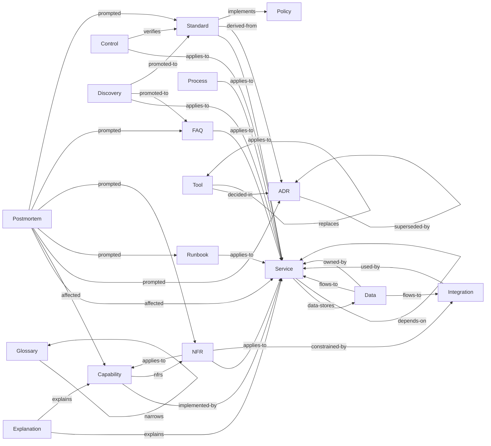

# Taxonomy

The kinds of knowledge this corpus holds, what each is for, and — more usefully — what each is *not*.

Most mistakes here are placement mistakes, not writing mistakes. Someone writes a good document and puts it in the wrong
folder, where it either duplicates something or is never found. The [decision table](#where-does-this-go) below is the
quickest route to the right answer; the [disambiguations](#disambiguations) explain the calls that are genuinely close.

## Where does this go?

The types **this corpus holds**, generated from the schema and ordered by what you are holding rather than by where it
ends up — so a corpus that has adopted five of them is offered five, and every row opens.

<!-- BEGIN GENERATED: types-placement -->

| You have…                                                            | It goes in                    |
|----------------------------------------------------------------------|-------------------------------|
| A check that proves a rule is being followed                         | [Controls](/controls)         |
| A commitment about how we engineer, at principle level               | [Policies](/policies)         |
| A decision that affects more than one repo, and its reasoning        | [ADRs](/adrs)                 |
| A description of what a deployable component is and does             | [Services](/services)         |
| A description of what we offer a customer, and why                   | [Capabilities](/capabilities) |
| A narrative of how something works or why it's shaped that way       | [Explanations](/explanations) |
| A problem with a known, confirmed fix                                | [FAQs](/faqs)                 |
| A rule people must follow when building                              | [Standards](/standards)       |
| A step-by-step for a planned task                                    | [Processes](/processes)       |
| A step-by-step for when something is broken                          | [Runbooks](/runbooks)         |
| A target for speed, uptime, or recovery                              | [NFRs](/nfrs)                 |
| A term whose meaning isn't obvious, or that we use in a specific way | [Glossaries](/glossary)       |
| A third-party or external system we depend on                        | [Integrations](/integrations) |
| A tool or package we've approved, rejected, or are trialling         | [Tools](/tools)               |
| An account of an incident and what caused it                         | [Postmortems](/postmortems)   |
| Something surprising you noticed and haven't verified                | [Discoveries](/discoveries)   |
| Where data lives, how long we keep it, and how sensitive it is       | [Data](/data)                 |

<!-- END GENERATED: types-placement -->

Where you got to mid-piece-of-work is the one thing on nobody's list: session logs stay local and never reach the
corpus.

If nothing fits, raise it rather than improvising. A missing type is a taxonomy conversation; a `misc/` folder is a
slow-motion failure. The framework declares more types than any one corpus stands up, so the answer may be to adopt one
rather than to invent one.

## The types

Grouped by [tier](../knowledge-as-code.md#tiers), because tier determines how each behaves, and generated from the same
schema as the table above. The fuller account of a type — what it looks like here, and the records already filed under
it — is on the type's own page.

<!-- BEGIN GENERATED: types-detail -->

### Decided — immutable once accepted

Superseded rather than rewritten, so what was thought at the time survives being wrong.

**[ADRs](/adrs)** — An architecturally significant decision affecting more than one repository, and the reasoning behind
it. The context, the choice, the alternatives weighed, the consequences. Immutable once accepted and superseded by a new
ADR rather than rewritten. A decision local to a single repository belongs in the repo that holds it, not here.

**[Postmortems](/postmortems)** — What actually happened during an incident — timeline, impact, root cause, contributing
factors, actions. Blameless, and immutable once published. The honest counterpart to the decision log: an ADR records
what was intended, a postmortem what the estate did about it.

### Normative — living, owned, reviewed

**[Controls](/controls)** — How a standard's rules are verified: the mechanism, the frequency, and the evidence it
leaves. Every control names the rules it covers. A rule no control claims is recorded as `not-enforced`, which is the
honest state and the number worth watching.

**[FAQs](/faqs)** — A problem with a confirmed fix, promoted from a discovery once a human has verified it. It carries
provenance back to the observation it came from, so the reader can see how far the fix has been taken on trust.

**[NFRs](/nfrs)** — A non-functional requirement — availability, latency, RPO, RTO — stated with how it is measured.
Capacity assumptions belong here too. An NFR with no measurement method is an aspiration, not a requirement.

**[Policies](/policies)** — A high-level engineering commitment: the what and the why, largely stack-agnostic and
changing rarely. Alignment to an external framework is stated clause by clause, as alignment rather than certification.

**[Standards](/standards)** — The rulebook — imperative, RFC 2119, with concrete examples and a conformance checklist.
Imperative throughout — **MUST**, **SHOULD**, **MAY**. Composed rather than read alone: the rules for a piece of work
are the union of the layers that apply to it.

### Descriptive — living, must mirror reality

These are the types CI can check against the estate rather than merely against themselves, which matters because they
rot faster than anything else.

**[Capabilities](/capabilities)** — What we offer a customer and why, as a hub linking to what implements, tests and
constrains it. A hub, sitting above the epic layer: it links to the work items that detail it, the services that
implement it, the feature files that test it, and the NFRs that constrain it. A capability that starts accumulating
detail of its own has stopped being one.

**[Data](/data)** — Which service owns which data, how long it is kept, how sensitive it is, and where personal data
flows. Organised by data domain rather than by processing activity. An engineer can use it; a regulator cannot.

**[Explanations](/explanations)** — Narrative that helps you understand how something works, or why it is shaped the way
it is. Architecture overviews, conceptual walkthroughs, how the pieces fit together. It links rather than restates: an
overview points at the documents holding the detail instead of repeating them. One that starts accumulating facts of its
own has become a maintenance liability.

**[Glossaries](/glossary)** — The ubiquitous language — terms whose meaning is specific to us, or which are easily
confused. One glossary per bounded context, each small enough to read end to end. A term that needs explaining every
time it appears belongs in the most general glossary that admits it, and everything else links to it.

**[Integrations](/integrations)** — An external system we depend on: the contract, the auth, the failure modes, their
SLA and our fallback. Every integration point needs a deliberate failure mode and a fallback, so the type requires both.
It also names who to call when the system is down.

**[Services](/services)** — One deployable component: purpose, repo, platform, environments, dependencies, data stores,
owner. The anchor most other types point at. Without it, a cross-reference has nothing to resolve against.

**[Tools](/tools)** — The approved-software register — what is chosen, rejected or deprecated, and the version ranges we
stand behind. Rejections are first-class content. Knowing what was turned down, and why, saves the next person the
evaluation.

### Procedural — living, must be rehearsed

Each records when it was last rehearsed. An unrehearsed process is annoying; an unrehearsed runbook is dangerous.

**[Processes](/processes)** — A planned procedure followed deliberately — releasing, onboarding, provisioning, rotating
a secret. Written to be followed by someone who has not done it before.

**[Runbooks](/runbooks)** — An incident-time procedure read under pressure: terse, imperative, structured as a decision
tree. Disaster recovery and estate rebuild live here.

### Observed — perishable, unreviewed until promoted

The tier carrying the least authority is the one a corpus most depends on, because capture that is not free does not
happen.

**[Discoveries](/discoveries)** — Something noticed during work and not yet verified, captured cheaply and expiring
unless promoted. Deliberately low-ceremony — a title, an observation, why it might matter — and carrying a confidence
level, so that "the build fails silently if X" has somewhere to go the moment it is noticed.

<!-- END GENERATED: types-detail -->

**Session state** is the one thing with no type: where a piece of work got to, for handover between sessions, and **not
stored in this repo**. Session logs routinely contain stack traces, connection strings and customer identifiers, so they
stay local. Only distilled, reviewed discoveries reach the corpus.

## How the types relate

The edges carry as much value as the nodes, and they are the part that breaks silently. Every one below is a
cross-reference field the schema declares, so CI can check that it resolves to a document that exists. That is why they
are declared rather than written as a link in prose.

<!-- BEGIN GENERATED: types-graph -->



<!-- END GENERATED: types-graph -->

The spine runs down the normative hierarchy: a standard implements a policy, a control verifies a standard, and both
land on a service. Everything else hangs off that. The same edges, field by field:

<!-- BEGIN GENERATED: types-edges -->

| From        | Field            | Points at                        | Answered by     |
|-------------|------------------|----------------------------------|-----------------|
| ADR         | `related`        | ADR                              |                 |
| ADR         | `superseded-by`  | ADR                              | `supersedes`    |
| ADR         | `supersedes`     | ADR                              | `superseded-by` |
| Capability  | `implemented-by` | Service                          |                 |
| Capability  | `nfrs`           | NFR                              |                 |
| Control     | `applies-to`     | Service                          |                 |
| Control     | `verifies`       | Standard                         | `verified-by`   |
| Data        | `flows-to`       | Service, Integration             |                 |
| Data        | `owned-by`       | Service                          |                 |
| Discovery   | `applies-to`     | Service                          |                 |
| Discovery   | `promoted-to`    | FAQ, Standard                    | `promoted-from` |
| Explanation | `explains`       | Service, Capability              |                 |
| FAQ         | `applies-to`     | Service                          |                 |
| FAQ         | `promoted-from`  | Discovery                        | `promoted-to`   |
| Glossary    | `narrows`        | Glossary                         |                 |
| Integration | `used-by`        | Service                          |                 |
| NFR         | `applies-to`     | Service, Capability              |                 |
| NFR         | `constrained-by` | Integration                      |                 |
| Postmortem  | `affected`       | Service, Capability              |                 |
| Postmortem  | `prompted`       | ADR, Runbook, NFR, FAQ, Standard |                 |
| Process     | `applies-to`     | Service                          |                 |
| Runbook     | `applies-to`     | Service                          |                 |
| Service     | `data-stores`    | Data                             |                 |
| Service     | `depends-on`     | Service                          |                 |
| Standard    | `applies-to`     | Service                          |                 |
| Standard    | `derived-from`   | ADR                              |                 |
| Standard    | `implements`     | Policy                           |                 |
| Standard    | `verified-by`    | Control                          | `verifies`      |
| Tool        | `decided-in`     | ADR                              |                 |
| Tool        | `replaces`       | Tool                             | `successor`     |
| Tool        | `successor`      | Tool                             | `replaces`      |

<!-- END GENERATED: types-edges -->

Reciprocal pairs must agree in both directions: `supersedes` / `superseded-by`, `verifies` / `verified-by`,
`promoted-from` / `promoted-to`. A one-sided link fails the build. The last column above is where you read that off: an
empty cell means nobody answers that edge, and nobody has to keep it in step.

Not every edge is a pair. A standard's `implements` points up at a policy and is never answered from the policy side:
policies are the layer a downstream corpus inherits, standards the layer it writes for itself, so what implements a
policy is not knowable from where the policy sits.

Nor does every edge leave from a whole document. A policy aligns with a framework through a single **clause** rather
than in its entirety, so the edge leaves the clause table and lands on a control — `pol-SCRT.KEYS` to Annex A A.8.24.
[Frameworks](/frameworks.md) is the far end of every one of those edges, and the only place our standing against a
framework is recorded. It carries no `ref:` and so appears in no row above.

## Layout

Each type follows the same shape:

```
<type>.md              # what it is, why, how to contribute — human-written
<type>/
  ├── _index.md        # index — GENERATED
  ├── _template.md     # what humans and agents copy
  └── <records>.md
```

`_` is reserved. A leading underscore means the framework's own artefact rather than a knowledge record — the generated
index and the template inside a type folder, the scaffolding directories alongside them. The tool reads the prefix, not
the names, so anything under it is excluded from discovery and never validated as a record. A record must therefore not
take it. The prefix also sorts ahead of letters whether or not a listing folds case, which is what keeps the framework's
files together at the top of a folder someone is scanning for content.

Alongside the types:

```
README.md              # orientation
CLAUDE.md              # agent guidance for working in this repository
frameworks.md          # external frameworks, and what each obliges us to
knowledge-as-code.md   # the approach
knowledge-as-code/     # the system's own documentation — outside the taxonomy
.corpus.yaml           # what this corpus is, and where it takes the framework from
.claude/skills/        # agent machinery for this corpus — SYNCED
.plugin/               # source for the plugin that carries this corpus's export — SYNCED, bar its manifest
.schema/               # the machine-readable schema — SYNCED
_plan/                 # migration scaffolding — temporary
_reports/              # GENERATED
```

## Disambiguations

The calls that are actually close. Each is written once, on the type its heading names first, and appears only where the
corpus holds both sides of it.

<!-- BEGIN GENERATED: types-versus -->

**ADR vs Standard.** The ADR is the decision and its reasoning, frozen. The standard is the rule that results, kept
current. If you are writing "we considered X and rejected it", that is an ADR; if you are writing "you **MUST** do Y",
that is a standard. Most substantial changes produce both.

**Capability vs Service.** A capability is what a customer gets. A service is a thing we deploy. One capability
typically spans several services; one service often contributes to several capabilities.

**Discovery vs FAQ.** A discovery is unverified and might be wrong or already fixed. An FAQ has been confirmed by a
human and carries authority. Never write straight to an FAQ from a session — capture the discovery and let promotion do
the work.

**Explanation vs ADR.** An explanation describes the shape something has; an ADR records the choice that gave it that
shape, and is frozen at the moment of choosing.

**Explanation vs Process.** An explanation says how something works; a process says how to perform a task. If a reader
is meant to follow it step by step, it is a process.

**Explanation vs Service.** An explanation covers how the pieces fit together; a service document describes one
deployable component. If it is about a single component, it is a service.

**Explanation vs Standard.** An explanation helps you understand; a standard tells you what to do. If it says you
**MUST** do something, it is a standard however much context surrounds it.

**Policy vs Standard.** A policy is true regardless of stack, framework or year — "we do not store secrets in source
control". A standard is specific enough to check — "read secrets from the vault via workload identity". If it would
still be true after replacing the entire technology estate, it is a policy.

**Process vs Runbook.** Are you doing this because you planned to, or because something is broken? Planned is a process.
Broken is a runbook.

**Standard vs Control.** The standard says what to do; the control says how we know it happened. "Secrets **MUST** come
from the vault" is a standard. "CI runs secret scanning on every PR" is a control. If it can fail a build, it is a
control.

**Tool vs ADR.** Adopting a tool is often a decision worth an ADR *and* an entry in the register. The ADR carries the
reasoning; the register carries the current state and the version range. Small, uncontroversial adoptions need only the
register.

<!-- END GENERATED: types-versus -->

One more call has only one side here. A **capability** is the product surface — Billing, Search, Notifications —
described once, above the epic layer, as a hub of links. A **spec** is the per-feature application of standards to a
concrete contract, and it belongs in the repo that owns the feature, next to the API description and the feature files
it describes. That follows the same central-versus-local rule as a decision record: cross-repo synthesis lives here,
feature-level detail lives with the code.

## Status of this taxonomy

Not all types are proven. Where that matters to a corpus, its own README is where the state is recorded.

Changing the taxonomy — adding a type, merging two, moving a type between tiers — is a larger act than editing any
document within it. Where a corpus holds ADRs, it belongs in one, amending whichever recorded the taxonomy in the first
place.
