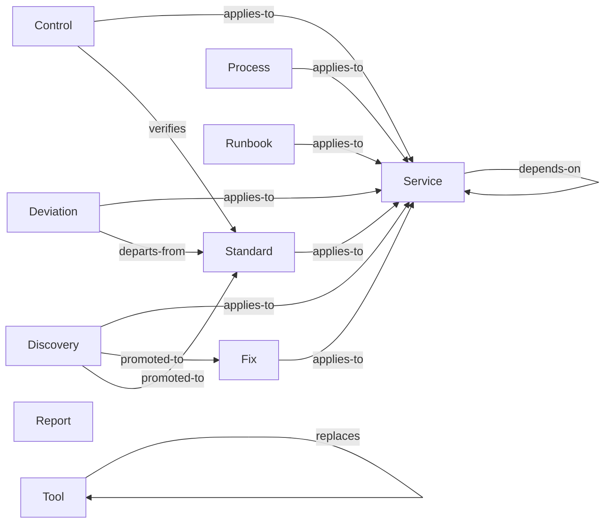

# Taxonomy

> The kinds of knowledge this corpus holds, what each is for, and what each is not.

The [decision table](#where-does-this-go) below is the quickest route to the right answer, and the
[disambiguations](#disambiguations) explain the calls that are genuinely close. Both cover the types this corpus adopted
and no others.

[Taxonomy][taxonomy] carries what is true of every corpus: what a tier is and what the five ask, the shape a type takes
on disk, and what changing a taxonomy costs.

## Where does this go?

The types this corpus holds, generated from the schema. The table is ordered by what you are holding, so scan the left
column for your row.

<!-- BEGIN GENERATED: types-placement -->

| You have…                                              | It goes in                       |
|--------------------------------------------------------|----------------------------------|
| A check that proves a rule is being followed           | [Controls](../controls.md)       |
| A departure from a rule that somebody agreed to        | [Deviations](../deviations.md)   |
| A problem with a known, verified resolution            | [Fixes](../fixes.md)             |
| A rule people must follow when building                | [Standards](../standards.md)     |
| A step-by-step for a planned task                      | [Processes](../processes.md)     |
| A step-by-step for when something is broken            | [Runbooks](../runbooks.md)       |
| A tool or package approved, rejected, or on trial      | [Tools](../tools.md)             |
| An answer about the corpus no single record states     | [Reports](../reports.md)         |
| Something surprising you noticed and have not verified | [Discoveries](../discoveries.md) |
| What a deployable component is and does                | [Services](../services.md)       |

<!-- END GENERATED: types-placement -->

If nothing fits, raise it. A missing type is a taxonomy conversation, and the answer is sometimes a type this corpus has
not adopted.

## The types

Grouped by [tier][tiers], because tier determines how each behaves, and generated from the same schema as the table
above. The fuller account of a type, meaning what it looks like here and the records already filed under it, is on the
type's own page.

<!-- BEGIN GENERATED: types-detail -->

### Normative: living, owned, reviewed

**[Controls](../controls.md).** How a standard's rules are verified: the mechanism, the frequency, and the evidence it
leaves. Every control lists the rules it verifies. A rule nothing checks gets a control whose mechanism is
`not-enforced`, so the gap is written down.

**[Deviations](../deviations.md).** A knowing departure from a rule, the person who accepted the risk, and the date it
is reviewed. The record says what is being done instead, why that was worth accepting, and what limits the risk
meanwhile. A year later, nobody can tell an unwritten departure from ignorance of the rule.

**[Fixes](../fixes.md).** A problem with a verified resolution, promoted from a discovery once somebody has checked it.
Each fix lists its verifications, so a reader can see how far the resolution has been taken on trust.

**[Standards](../standards.md).** The rulebook, imperative, RFC 2119, with concrete examples and a conformance
checklist. Imperative throughout: **MUST**, **SHOULD**, **MAY**. Standards compose: the rules for a piece of work are
the union of the folders that apply to it.

### Descriptive: living, must mirror reality

CI can check these against the estate itself. They also fall out of date fastest.

**[Reports](../reports.md).** A question about the corpus, answered across every record, with the judgement a person
added. Which clauses nothing implements, which framework references have only one citation. `kac report` fills every
cell the corpus states, and leaves the judgement cells open. A report becomes a record here once somebody has answered
them.

**[Services](../services.md).** One deployable component: purpose, repo, platform, environments, dependencies, data
stores, owner. The record most other types point at. Without it, a cross-reference has nothing to resolve against.

**[Tools](../tools.md).** The approved-software register. What is chosen, rejected or deprecated, and the version range
for each. Knowing what was turned down, and why, saves the next person the evaluation.

### Procedural: living, must be rehearsed

Each records when it was last rehearsed. An unrehearsed process is annoying. An unrehearsed runbook is dangerous.

**[Processes](../processes.md).** A planned procedure (releasing, onboarding, provisioning, rotating a secret). Write
each one for somebody who has not done it before.

**[Runbooks](../runbooks.md).** An incident-time procedure read under pressure: terse, imperative, structured as a
decision tree. Disaster recovery and estate rebuild are runbooks.

### Observed: perishable, unreviewed until promoted

The tier with the least authority is the one a corpus most depends on. Capture has to be cheap, or it does not happen.

**[Discoveries](../discoveries.md).** Something noticed during work and not yet verified, captured cheaply and expiring
unless promoted. A title, an observation, why it might matter, and a confidence level. "The build fails silently if X"
then has somewhere to go the moment somebody notices it.

<!-- END GENERATED: types-detail -->

## How the types relate

The edges carry as much value as the nodes, and they are the part that breaks silently. Every one below is a
cross-reference field the schema declares, so CI can check that it resolves to a document that exists.

<!-- BEGIN GENERATED: types-graph -->

<!-- END GENERATED: types-graph -->

The spine runs down the normative hierarchy: a standard implements a policy, a control verifies a standard, and both
land on a service. Everything else hangs off that. The same edges, field by field:

<!-- BEGIN GENERATED: types-edges -->

| From      | Field           | Points at     | Answered by     |
|-----------|-----------------|---------------|-----------------|
| Control   | `applies-to`    | Service       |                 |
| Control   | `verifies`      | Standard      | `verified-by`   |
| Deviation | `applies-to`    | Service       |                 |
| Deviation | `departs-from`  | Standard      |                 |
| Discovery | `applies-to`    | Service       |                 |
| Discovery | `promoted-to`   | Fix, Standard | `promoted-from` |
| Fix       | `applies-to`    | Service       |                 |
| Fix       | `promoted-from` | Discovery     | `promoted-to`   |
| Process   | `applies-to`    | Service       |                 |
| Runbook   | `applies-to`    | Service       |                 |
| Service   | `depends-on`    | Service       |                 |
| Standard  | `applies-to`    | Service       |                 |
| Standard  | `promoted-from` | Discovery     | `promoted-to`   |
| Standard  | `verified-by`   | Control       | `verifies`      |
| Tool      | `replaces`      | Tool          | `successor`     |
| Tool      | `successor`     | Tool          | `replaces`      |

<!-- END GENERATED: types-edges -->

Reciprocal pairs must agree in both directions: `supersedes` / `superseded-by`, `verifies` / `verified-by`,
`promoted-from` / `promoted-to`. A one-sided link fails the build. Read that off the last column above. An empty cell
means nobody answers that edge, and nobody has to keep it in step.

Not every edge is a pair. A standard's `implements` points up at a policy, and the policy never points back. Policies
are the layer a downstream corpus inherits, and standards are the layer it writes for itself, so nobody sitting at the
policy can know what implements it.

Nor does every edge leave from a whole document. A policy aligns with a framework through a single **clause** rather
than in its entirety, so the edge leaves the clause table and lands on a control: `pol-SCRT.KEYS` to Annex A A.8.24.
[Frameworks](../frameworks.md) is the far end of every one of those edges, and the only page that records our standing
against a framework. It carries no `ref:` and so appears in no row above.

## Disambiguations

The calls that are actually close. Each is written once, on the type its heading names first, and appears only where
this corpus holds both sides of it.

<!-- BEGIN GENERATED: types-versus -->

**Discovery vs Fix.** A discovery is unverified, and might be wrong or already fixed. A fix has been checked by
somebody, so it has authority. Never write straight to a fix from a session. Capture the discovery and let promotion do
the work.

**Process vs Runbook.** Are you doing this because you planned to, or because something is broken? Planned is a process.
Broken is a runbook.

**Report vs Discovery.** A report is a walk over the corpus, repeatable and dated. A discovery is something somebody
noticed once. If nothing would reproduce it, it is a discovery.

**Standard vs Control.** The standard says what to do. The control says how anybody can tell it happened. "Secrets
**MUST** come from the vault" is a standard. "CI runs secret scanning on every PR" is a control. If it can fail a build,
it is a control.

<!-- END GENERATED: types-versus -->

## Status of this taxonomy

Not all types are proven. Where that matters, this corpus's own `README.md` records which have met real content.

[taxonomy]: https://paul80nd.github.io/knowledge-as-code/framework/taxonomy/
[tiers]: https://paul80nd.github.io/knowledge-as-code/framework/taxonomy/#the-five-tiers
