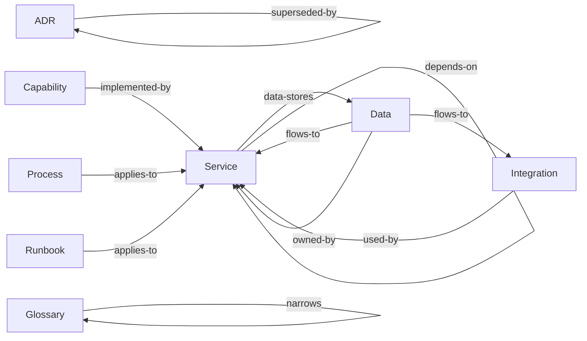

# Taxonomy

> The kinds of knowledge this corpus holds, what each is for, and what each is not.

The [decision table](#where-does-this-go) below is the quickest route to the right answer, and the
[disambiguations](#disambiguations) explain the calls that are genuinely close. Both cover the types this corpus adopted
and no others.

[Taxonomy][taxonomy] carries what is true of every corpus: what a tier is and what the five ask, the shape a type takes
on disk, and what changing a taxonomy costs.

## Where does this go?

The types this corpus holds, generated from the schema. The table is ordered by what you are holding, so scan the left
column for your row.

<!-- BEGIN GENERATED: types-placement -->

| You have…                                                            | It goes in                         |
|----------------------------------------------------------------------|------------------------------------|
| A decision that affects more than one repo, and its reasoning        | [ADRs](../adrs.md)                 |
| A description of what a deployable component is and does             | [Services](../services.md)         |
| A description of what we offer a customer, and why                   | [Capabilities](../capabilities.md) |
| A step-by-step for a planned task                                    | [Processes](../processes.md)       |
| A step-by-step for when something is broken                          | [Runbooks](../runbooks.md)         |
| A term whose meaning isn't obvious, or that we use in a specific way | [Glossaries](../glossary.md)       |
| A third-party or external system we depend on                        | [Integrations](../integrations.md) |
| Where data lives, how long we keep it, and how sensitive it is       | [Data](../data.md)                 |

<!-- END GENERATED: types-placement -->

If nothing fits, raise it. A missing type is a taxonomy conversation, and the answer is sometimes a type this corpus has
not adopted.

## The types

Grouped by [tier][tiers], because tier determines how each behaves, and generated from the same schema as the table
above. The fuller account of a type, meaning what it looks like here and the records already filed under it, is on the
type's own page.

<!-- BEGIN GENERATED: types-detail -->

### Decided: immutable once accepted

Superseded rather than rewritten, so what was thought at the time survives being wrong.

**[ADRs](../adrs.md).** An architecturally significant decision affecting more than one repository, and the reasoning
behind it. The context, the choice, the alternatives weighed, the consequences. Immutable once accepted and superseded
by a new ADR rather than rewritten. A decision local to a single repository belongs in the repo that holds it, not here.

### Descriptive: living, must mirror reality

These are the types CI can check against the estate rather than merely against themselves, which matters because they
rot faster than anything else.

**[Capabilities](../capabilities.md).** What we offer a customer and why, as a hub linking to what implements, tests and
constrains it. A hub, sitting above the epic layer: it links to the work items that detail it, the services that
implement it, the feature files that test it, and the NFRs that constrain it. A capability that starts accumulating
detail of its own has stopped being one.

**[Data](../data.md).** Which service owns which data, how long it is kept, how sensitive it is, and where personal data
flows. Organised by data domain rather than by processing activity. An engineer can use it; a regulator cannot.

**[Glossaries](../glossary.md).** The ubiquitous language. Terms whose meaning is specific to us, or which are easily
confused. One glossary per bounded context, each small enough to read end to end. A term that needs explaining every
time it appears belongs in the most general glossary that admits it, and everything else links to it.

**[Integrations](../integrations.md).** An external system we depend on: the contract, the auth, the failure modes,
their SLA and our fallback. Every integration point needs a deliberate failure mode and a fallback, so the type requires
both. It also names who to call when the system is down.

**[Services](../services.md).** One deployable component: purpose, repo, platform, environments, dependencies, data
stores, owner. The anchor most other types point at. Without it, a cross-reference has nothing to resolve against.

### Procedural: living, must be rehearsed

Each records when it was last rehearsed. An unrehearsed process is annoying. An unrehearsed runbook is dangerous.

**[Processes](../processes.md).** A planned procedure followed deliberately (releasing, onboarding, provisioning,
rotating a secret). Written to be followed by someone who has not done it before.

**[Runbooks](../runbooks.md).** An incident-time procedure read under pressure: terse, imperative, structured as a
decision tree. Disaster recovery and estate rebuild live here.

<!-- END GENERATED: types-detail -->

## How the types relate

The edges carry as much value as the nodes, and they are the part that breaks silently. Every one below is a
cross-reference field the schema declares, so CI can check that it resolves to a document that exists.

<!-- BEGIN GENERATED: types-graph -->

<!-- END GENERATED: types-graph -->

The spine runs down the normative hierarchy: a standard implements a policy, a control verifies a standard, and both
land on a service. Everything else hangs off that. The same edges, field by field:

<!-- BEGIN GENERATED: types-edges -->

| From        | Field            | Points at            | Answered by     |
|-------------|------------------|----------------------|-----------------|
| ADR         | `related`        | ADR                  |                 |
| ADR         | `superseded-by`  | ADR                  | `supersedes`    |
| ADR         | `supersedes`     | ADR                  | `superseded-by` |
| Capability  | `implemented-by` | Service              |                 |
| Data        | `flows-to`       | Service, Integration |                 |
| Data        | `owned-by`       | Service              |                 |
| Glossary    | `narrows`        | Glossary             |                 |
| Integration | `used-by`        | Service              |                 |
| Process     | `applies-to`     | Service              |                 |
| Runbook     | `applies-to`     | Service              |                 |
| Service     | `data-stores`    | Data                 |                 |
| Service     | `depends-on`     | Service              |                 |

<!-- END GENERATED: types-edges -->

Reciprocal pairs must agree in both directions: `supersedes` / `superseded-by`, `verifies` / `verified-by`,
`promoted-from` / `promoted-to`. A one-sided link fails the build. Read that off the last column above. An empty cell
means nobody answers that edge, and nobody has to keep it in step.

Not every edge is a pair. A standard's `implements` points up at a policy, and the policy never points back. Policies
are the layer a downstream corpus inherits, and standards are the layer it writes for itself, so nobody sitting at the
policy can know what implements it.

Nor does every edge leave from a whole document. A policy aligns with a framework through a single **clause** rather
than in its entirety, so the edge leaves the clause table and lands on a control: `pol-SCRT.KEYS` to Annex A A.8.24.
[Frameworks](../frameworks.md) is the far end of every one of those edges, and the only page that records our standing
against a framework. It carries no `ref:` and so appears in no row above.

## Disambiguations

The calls that are actually close. Each is written once, on the type its heading names first, and appears only where
this corpus holds both sides of it.

<!-- BEGIN GENERATED: types-versus -->

**Capability vs Service.** A capability is what a customer gets. A service is a thing we deploy. One capability
typically spans several services. One service often contributes to several capabilities.

**Process vs Runbook.** Are you doing this because you planned to, or because something is broken? Planned is a process.
Broken is a runbook.

<!-- END GENERATED: types-versus -->

## Status of this taxonomy

Not all types are proven. Where that matters, this corpus's own `README.md` records which have met real content.

[taxonomy]: https://paul80nd.github.io/knowledge-as-code/framework/taxonomy/
[tiers]: https://paul80nd.github.io/knowledge-as-code/framework/taxonomy/#the-five-tiers
