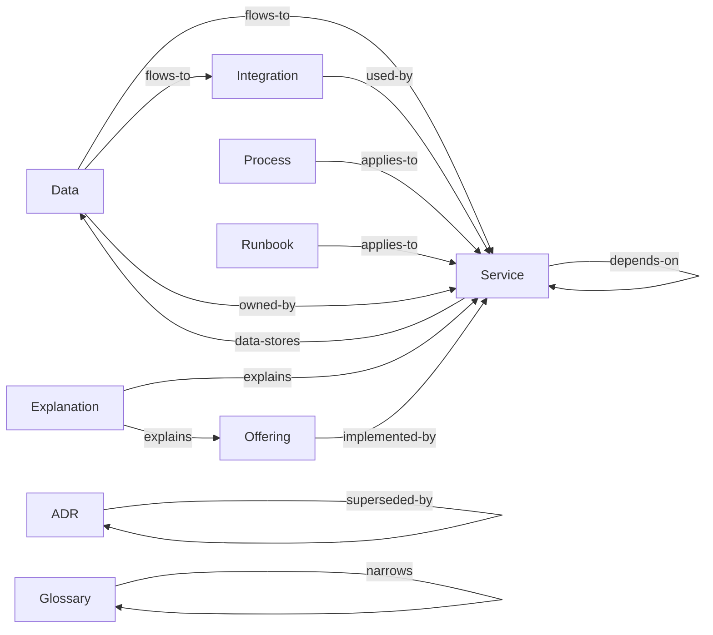

# Taxonomy

> The kinds of knowledge this corpus holds, what each is for, and what each is not.

The [decision table](#where-does-this-go) below is the quickest route to the right answer, and the
[disambiguations](#disambiguations) explain the calls that are genuinely close. Both cover the types this corpus adopted
and no others.

[Taxonomy][taxonomy] carries what is true of every corpus: what a tier is and what the five ask, the shape a type takes
on disk, and what changing a taxonomy costs.

## Where does this go?

The types this corpus holds, generated from the schema. The table is ordered by what you are holding, so scan the left
column for your row.

<!-- BEGIN GENERATED: types-placement -->

| You have…                                                        | It goes in                         |
|------------------------------------------------------------------|------------------------------------|
| A decision affecting more than one repository, and its reasoning | [ADRs](../adrs.md)                 |
| A step-by-step for a planned task                                | [Processes](../processes.md)       |
| A step-by-step for when something is broken                      | [Runbooks](../runbooks.md)         |
| A term whose meaning is local, or not obvious                    | [Glossaries](../glossary.md)       |
| A third-party or external system the estate depends on           | [Integrations](../integrations.md) |
| How something works, or why it is shaped that way                | [Explanations](../explanations.md) |
| What a deployable component is and does                          | [Services](../services.md)         |
| What the organisation offers a customer, and why                 | [Offerings](../offerings.md)       |
| Where data lives, how long it is kept, and its sensitivity       | [Data](../data.md)                 |

<!-- END GENERATED: types-placement -->

If nothing fits, raise it. A missing type is a taxonomy conversation, and the answer is sometimes a type this corpus has
not adopted.

## The types

Grouped by [tier][tiers], because tier determines how each behaves, and generated from the same schema as the table
above. The fuller account of a type, meaning what it looks like here and the records already filed under it, is on the
type's own page.

<!-- BEGIN GENERATED: types-detail -->

### Decided: immutable once accepted

What was decided is superseded rather than rewritten, so what was thought at the time survives being wrong.

**[ADRs](../adrs.md).** An architecturally significant decision affecting more than one repository, and the reasoning
behind it. The context, the choice, the alternatives weighed, and the consequences. An accepted ADR is immutable, so a
later ADR supersedes it. A decision that affects only one repository belongs in that repository.

### Descriptive: living, must mirror reality

CI can check these against the estate itself. They also fall out of date fastest.

**[Data](../data.md).** Which service owns which data, how long it is kept, how sensitive it is, and where personal data
flows. One document per data domain, written for an engineer. It records the entities in the domain, the store they live
in, the service that owns them, how sensitive they are, and how long they are kept.

**[Explanations](../explanations.md).** Narrative that helps you understand how something works, or why it is shaped the
way it is. Architecture overviews, conceptual walkthroughs, and how the pieces fit together. An explanation points at
the documents with the detail and does not repeat it. One that accumulates facts of its own falls out of date as soon as
those facts move.

**[Glossaries](../glossary.md).** The ubiquitous language. Terms with a meaning specific to the organisation, or easily
confused with another. One glossary per bounded context, each small enough to read end to end. A term that needs
explaining every time it appears belongs in the most general glossary that admits it, and the narrower glossaries link
to that entry.

**[Integrations](../integrations.md).** An external system the estate depends on: its contract, auth, failure modes, SLA
and fallback. One document per external system. It records the contract, how a caller authenticates, what happens when
the system is down, and who to call about it.

**[Offerings](../offerings.md).** What the organisation offers a customer, and why, with links to the services and NFRs
behind it. An offering sits above the work items. It links to the ones that detail it, the services that implement it,
the feature files that test it, and the NFRs that constrain it. An offering that accumulates detail of its own has
stopped being one.

**[Services](../services.md).** One deployable component: purpose, repo, platform, environments, dependencies, data
stores, owner. The record most other types point at. Without it, a cross-reference has nothing to resolve against.

### Procedural: living, must be rehearsed

Each records when it was last rehearsed. An unrehearsed process is annoying. An unrehearsed runbook is dangerous.

**[Processes](../processes.md).** A planned procedure (releasing, onboarding, provisioning, rotating a secret). Write
each one for somebody who has not done it before.

**[Runbooks](../runbooks.md).** An incident-time procedure read under pressure: terse, imperative, structured as a
decision tree. Disaster recovery and estate rebuild are runbooks.

<!-- END GENERATED: types-detail -->

## How the types relate

The edges carry as much value as the nodes, and they are the part that breaks silently. Every one below is a
cross-reference field the schema declares, so CI can check that it resolves to a document that exists.

<!-- BEGIN GENERATED: types-graph -->

<!-- END GENERATED: types-graph -->

The spine runs down the normative hierarchy: a standard implements a policy, a control verifies a standard, and both
land on a service. Everything else hangs off that. The same edges, field by field:

<!-- BEGIN GENERATED: types-edges -->

| From        | Field            | Points at            | Answered by     |
|-------------|------------------|----------------------|-----------------|
| ADR         | `related`        | ADR                  |                 |
| ADR         | `superseded-by`  | ADR                  | `supersedes`    |
| ADR         | `supersedes`     | ADR                  | `superseded-by` |
| Data        | `flows-to`       | Service, Integration |                 |
| Data        | `owned-by`       | Service              |                 |
| Explanation | `explains`       | Service, Offering    |                 |
| Glossary    | `narrows`        | Glossary             |                 |
| Integration | `used-by`        | Service              |                 |
| Offering    | `implemented-by` | Service              |                 |
| Process     | `applies-to`     | Service              |                 |
| Runbook     | `applies-to`     | Service              |                 |
| Service     | `data-stores`    | Data                 |                 |
| Service     | `depends-on`     | Service              |                 |

<!-- END GENERATED: types-edges -->

Reciprocal pairs must agree in both directions: `supersedes` / `superseded-by`, `verifies` / `verified-by`,
`replaces` / `successor`. A one-sided link fails the build. Read that off the last column above. An empty cell
means nobody answers that edge, and nobody has to keep it in step.

Not every edge is a pair. A standard's `implements` points up at a policy, and the policy never points back. Policies
are the layer a downstream corpus inherits, and standards are the layer it writes for itself, so nobody sitting at the
policy can know what implements it.

Nor does every edge leave from a whole document. A policy aligns with a framework through a single **clause** rather
than in its entirety, so the edge leaves the clause table and lands on a control: `pol-SCRT.KEYS` to Annex A A.8.24.
[Frameworks](../frameworks.md) is the far end of every one of those edges, and the only page that records our standing
against a framework. It carries no `ref:` and so appears in no row above.

## Disambiguations

The calls that are actually close. Each is written once, on the type its heading names first, and appears only where
this corpus holds both sides of it.

<!-- BEGIN GENERATED: types-versus -->

**Explanation vs ADR.** An explanation describes the shape something has. An ADR records the choice that gave it that
shape, and is frozen at the moment of choosing.

**Explanation vs Process.** An explanation says how something works. A process says how to perform a task. If a reader
is meant to follow it step by step, it is a process.

**Explanation vs Service.** An explanation covers how the pieces fit together. A service document describes one
deployable component. If it is about a single component, it is a service.

**Offering vs Service.** An offering is what a customer gets. A service is something the organisation deploys. One
offering usually spans several services. One service usually contributes to several offerings.

**Process vs Runbook.** Are you doing this because you planned to, or because something is broken? Planned is a process.
Broken is a runbook.

<!-- END GENERATED: types-versus -->

## Status of this taxonomy

Not all types are proven. Where that matters, this corpus's own `README.md` records which have met real content.

[taxonomy]: https://paul80nd.github.io/knowledge-as-code/framework/taxonomy/
[tiers]: https://paul80nd.github.io/knowledge-as-code/framework/taxonomy/#the-four-tiers
