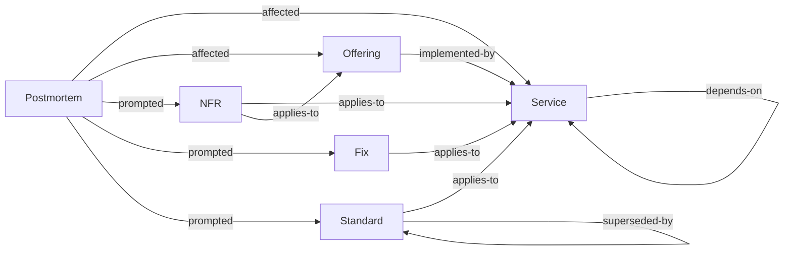

# Taxonomy

> The kinds of knowledge this corpus holds, what each is for, and what each is not.

The [decision table](#where-does-this-go) below is the quickest route to the right answer, and the
[disambiguations](#disambiguations) explain the calls that are genuinely close. Both cover the types this corpus adopted
and no others.

[Taxonomy][taxonomy] carries what is true of every corpus: what a tier is and what the five ask, the shape a type takes
on disk, and what changing a taxonomy costs.

## Where does this go?

The types this corpus holds, generated from the schema. The table is ordered by what you are holding, so scan the left
column for your row.

<!-- BEGIN GENERATED: types-placement -->

| You have…                                        | It goes in                       |
|--------------------------------------------------|----------------------------------|
| A problem with a known, verified resolution      | [Fixes](../fixes.md)             |
| A rule people must follow when building          | [Standards](../standards.md)     |
| A target for speed, uptime, or recovery          | [NFRs](../nfrs.md)               |
| An account of an incident and what caused it     | [Postmortems](../postmortems.md) |
| What a deployable component is and does          | [Services](../services.md)       |
| What the organisation offers a customer, and why | [Offerings](../offerings.md)     |

<!-- END GENERATED: types-placement -->

If nothing fits, raise it. A missing type is a taxonomy conversation, and the answer is sometimes a type this corpus has
not adopted.

## The types

Grouped by [tier][tiers], because tier determines how each behaves, and generated from the same schema as the table
above. The fuller account of a type, meaning what it looks like here and the records already filed under it, is on the
type's own page.

<!-- BEGIN GENERATED: types-detail -->

### Decided: immutable once accepted

What was decided is superseded rather than rewritten, so what was thought at the time survives being wrong.

**[Postmortems](../postmortems.md).** What happened during an incident (timeline, impact, root cause, contributing
factors, actions). Blameless, and immutable once published. An ADR records the intention, and a postmortem records the
outcome.

### Normative: living, owned, reviewed

**[Fixes](../fixes.md).** A problem with a resolution somebody has verified. Each fix lists its verifications, so a
reader can see how far the resolution has been taken on trust.

**[NFRs](../nfrs.md).** A non-functional requirement (availability, latency, RPO, RTO) stated with how it is measured.
Capacity assumptions belong here too. A target nobody measures is an aspiration.

**[Standards](../standards.md).** The rulebook, imperative, BCP 14, with concrete examples and a conformance checklist.
Imperative throughout, in bold capitals: **MUST**, **MUST NOT**, **SHOULD**, **SHOULD NOT** and **MAY**. Only the
`Rules` section binds, and every other section explains, shows or checks, so a modal written outside it obliges nobody.
Standards compose: the rules for a piece of work are the union of the folders that apply to it, and of the standards
each of those names in `depends-on`.

### Descriptive: living, must mirror reality

CI can check these against the estate itself. They also fall out of date fastest.

**[Offerings](../offerings.md).** What the organisation offers a customer, and why, with links to the services and NFRs
behind it. An offering sits above the work items. It links to the ones that detail it, the services that implement it,
the feature files that test it, and the NFRs that constrain it. An offering that accumulates detail of its own has
stopped being one.

**[Services](../services.md).** One deployable component: purpose, repos, platform, environments, dependencies, data
stores, owner. The record most other types point at. Without it, a cross-reference has nothing to resolve against.

<!-- END GENERATED: types-detail -->

## How the types relate

The edges carry as much value as the nodes, and they are the part that breaks silently. Every one below is a
cross-reference field the schema declares, so CI can check that it resolves to a document that exists.

<!-- BEGIN GENERATED: types-graph -->

<!-- END GENERATED: types-graph -->

The spine runs down the normative hierarchy: a standard implements a policy, a control verifies a standard, and both
land on a service. Everything else hangs off that. The same edges, field by field:

<!-- BEGIN GENERATED: types-edges -->

| From       | Field            | Points at          | Answered by     |
|------------|------------------|--------------------|-----------------|
| Fix        | `applies-to`     | Service            |                 |
| NFR        | `applies-to`     | Service, Offering  | `nfrs`          |
| Offering   | `implemented-by` | Service            |                 |
| Offering   | `nfrs`           | NFR                | `applies-to`    |
| Postmortem | `affected`       | Service, Offering  |                 |
| Postmortem | `prompted`       | NFR, Fix, Standard |                 |
| Service    | `depends-on`     | Service            |                 |
| Service    | `nfrs`           | NFR                | `applies-to`    |
| Standard   | `applies-to`     | Service            |                 |
| Standard   | `depends-on`     | Standard           |                 |
| Standard   | `superseded-by`  | Standard           | `supersedes`    |
| Standard   | `supersedes`     | Standard           | `superseded-by` |

<!-- END GENERATED: types-edges -->

Reciprocal pairs must agree in both directions: `supersedes` / `superseded-by`, `verifies` / `verified-by`,
`replaces` / `successor`. A one-sided link fails the build. Read that off the last column above. An empty cell
means nobody answers that edge, and nobody has to keep it in step.

Not every edge is a pair. A standard's `implements` points up at a policy, and the policy never points back. Policies
are the layer a downstream corpus inherits, and standards are the layer it writes for itself, so nobody sitting at the
policy can know what implements it.

Nor does every edge leave from a whole document. A policy aligns with a framework through a single **clause** rather
than in its entirety, so the edge leaves the clause table and lands on a control: `pol-SCRT.KEYS` to Annex A A.8.24.
[Frameworks](../frameworks.md) is the far end of every one of those edges, and the only page that records our standing
against a framework. It carries no `ref:` and so appears in no row above.

## Disambiguations

The calls that are actually close. Each is written once, on the type its heading names first, and appears only where
this corpus holds both sides of it.

<!-- BEGIN GENERATED: types-versus -->

**Offering vs Service.** An offering is what a customer gets. A service is something the organisation deploys. One
offering usually spans several services. One service usually contributes to several offerings.

<!-- END GENERATED: types-versus -->

## Status of this taxonomy

Not all types are proven. Where that matters, this corpus's own `README.md` records which have met real content.

[taxonomy]: https://paul80nd.github.io/knowledge-as-code/framework/taxonomy/
[tiers]: https://paul80nd.github.io/knowledge-as-code/framework/taxonomy/#the-four-tiers
