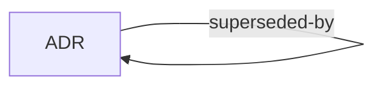

# Taxonomy

## Where does this go?

<!-- BEGIN GENERATED: types-placement -->

| You have…                                                        | It goes in         |
|------------------------------------------------------------------|--------------------|
| A decision affecting more than one repository, and its reasoning | [ADRs](../adrs.md) |

<!-- END GENERATED: types-placement -->

## The types

<!-- BEGIN GENERATED: types-detail -->

### Decided: immutable once accepted

Superseded, never rewritten, so what was thought at the time survives being wrong.

**[ADRs](../adrs.md).** An architecturally significant decision affecting more than one repository, and the reasoning
behind it. The context, the choice, the alternatives weighed, and the consequences. An accepted ADR is immutable, so a
later ADR supersedes it. A decision that affects only one repository belongs in that repository.

<!-- END GENERATED: types-detail -->

## Disambiguations

<!-- BEGIN GENERATED: types-versus -->
<!-- END GENERATED: types-versus -->

## How the types relate

<!-- BEGIN GENERATED: types-graph -->

<!-- END GENERATED: types-graph -->

<!-- BEGIN GENERATED: types-edges -->

| From | Field           | Points at | Answered by     |
|------|-----------------|-----------|-----------------|
| ADR  | `related`       | ADR       |                 |
| ADR  | `superseded-by` | ADR       | `supersedes`    |
| ADR  | `supersedes`    | ADR       | `superseded-by` |

<!-- END GENERATED: types-edges -->
